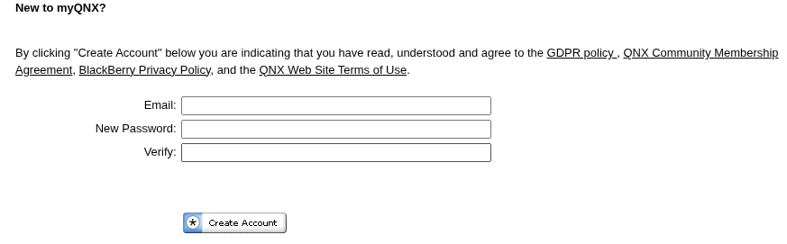
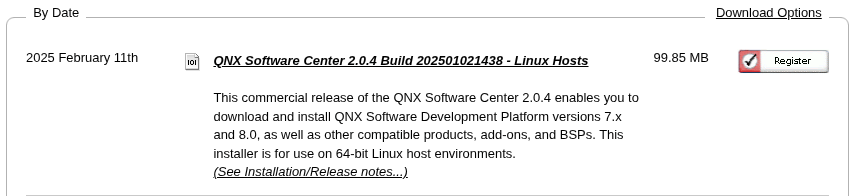
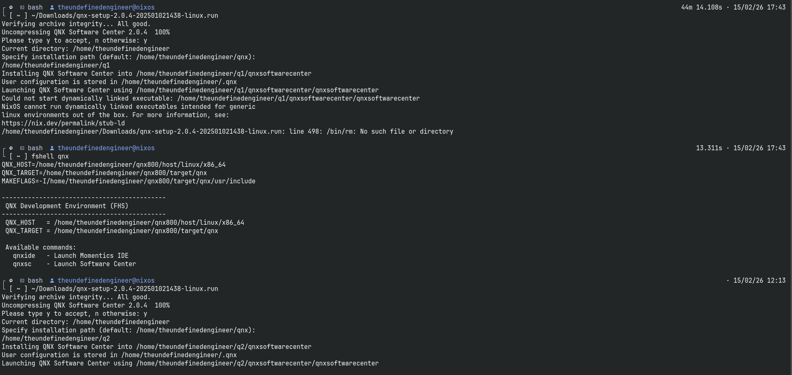
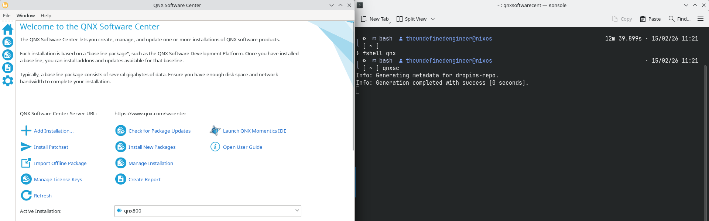

# QNX on NixOS


qnx-on-nixos provides a stable FHS-based compatibility layer for running
QNX Software Development Platform (SDP), Momentics IDE, and QNX Software
Center on NixOS.

Since NixOS does not support generic dynamically linked Linux binaries
out of the box, this project uses buildFHSEnv to create a controlled
Filesystem Hierarchy Standard (FHS) environment that allows proprietary
QNX binaries to execute correctly.

This repository does not distribute QNX software. Users must obtain
QNX SDP legally from BlackBerry.

## Overview

NixOS does not support generic dynamically linked Linux binaries out of the box. Proprietary tools such as QNX Software Center and QNX SDP expect a traditional Linux filesystem layout, including paths like:
```bash
/usr/lib
/lib
/lib64
```
This project creates an FHS-compatible environment using `buildFHSEnv` so that QNX tools can run without stub loader errors.

## Features

- FHS environment using `buildFHSEnv`
- Automatic QNX SDK environment sourcing
- One-command development shell
- IDE launcher script
- Software Center launcher script
- No flakes required
- Stable across terminals
- Current release: v1.0.0

## Tested With

- NixOS 25.11 (Xantusia) x86_64
- Nix: 2.31.2
- QNX SDP 8.0
- QNX Software Center: Linux version

## Repository Structure
```
qnx-on-nixos/
│
├── README.md
├── LICENSE
│
├── fhs-shell/
│   ├── qnx-fhs.nix
│   ├── fshell
│   ├── qnxide
│   └── qnxsc
│
└── docs/
    └── setup-guide.md
```

## Requirements

- NixOS (recommended) or Linux with Nix installed
- Legal access to QNX Software Development Platform
- QNX Software Center for Linux (downloaded from BlackBerry)

*This repository does not distribute QNX software.*

## Installing QNX Software Center

### Step 1: Download

1. [Create Account](https://www.qnx.com/account/login.html#showcreate)


2. [Download Linux version of QNX Software Center](https://www.qnx.com/download/group.html?programid=29178)


### Step 2: Make It Exeutable
```bash
cd ~/Downloads
chmod +x qnx-setup-2.0.4-202501021438-linux.run
```

### Step 3: Installing fhs-shell

#### 1. Clone the Repository:
```bash
git clone https://github.com/TheUndefinedEngineer/qnx-on-nixos.git
cd qnx-on-nixos
```
You may place the repository anywhere (for example ~/Workspace/).

#### 2. Add fhs-shell to PATH:
Add this line to your ~/.bashrc:
```bash
export PATH="$HOME/qnx-on-nixos/fhs-shell:$PATH"
```
Adjust the path if you cloned it elsewhere.

Reload your shell:
```bash
source ~/.bashrc
```

#### 3. Verify Installation
Run:
```bash
which fshell
```
It should print something like:
```bash
/home/<username>/qnx-on-nixos/fhs-shell/fshell
```
If it does, the wrapper is installed correctly.

### Step 4: Enter the FHS Environment
Before running the installer, enter the FHS shell:
```bash
fshell qnx
```
This activates the compatibility environment required for dynamically linked QNX binaries.

*Note: The wrapper assumes QNX is installed in `~/qnx` and `~/qnx800`.
If you install QNX elsewhere, update the paths inside `fhs-shell/qnx-fhs.nix` accordingly.*


### Step 5: Run the Installer
Inside the FHS shell:
```bash
~/Downloads/qnx-setup-2.0.4-202501021438-linux.run 
```
Default location:
```bash
/home/<username>/qnx
```
You may choose a different location, but the default structure in this project assumes ~/qnx.



### Step 6: Launch QNX Software Center
Still inside the FHS shell:
```bash
qnxsc
```
Log in with your QNX account.



## Installing QNX Momentics IDE
Once inside QNX Software Center:
1. Select `Add Installation...` -> `QNX Momentics IDE` -> Select stable version and install.
2. Default location:
```bash
~/qnx/qnxmomenticside
```
## Installing QNX SDP
Once inside QNX Software Center:
1. Select `Add Installation...` -> `QNX Software Development Platform (7.0/7.1/8.0)` -> Select stable version and install.
2. Default location:
```bash
~/qnx{700/710/800}
```
3. Verifying SDP Installation
- Inside FSH shell:
```bash
source ~/qnx800/qnxsdp-env.sh
qcc --version
```
If the compiler version prints correctly, the SDK is installed and configured properly.

## Troubleshooting
#### Stub Loader Error
If you see:
```bash
Could not start dynamically linked executable
NixOS cannot run dynamically linked executables intended for generic linux environments
```
You are not inside the FHS environment.
**Solution:**
```bash
fshell qnx
```
Then launch the tool again.

#### `/usr/lib` Does Not Exist
If:
```bash
ls /usr/lib
```
returns "No such file or directory", FHS is not active.

Ensure your qnx-fhs.nix ends with:
```bash
}).env
```
This is required for nix-shell to enter the FHS environment properly.

## Legal Notice

*This project does not distribute QNX software.*

*Users must obtain QNX Software Development Platform legally from BlackBerry. This repository only provides a compatibility wrapper for NixOS.*

### License

This project is licensed under the MIT License.

### Contributing

Pull requests are welcome for:
- Additional QNX version support
- Improved dependency lists
- Enhanced documentation
- Multi-version SDK switching
